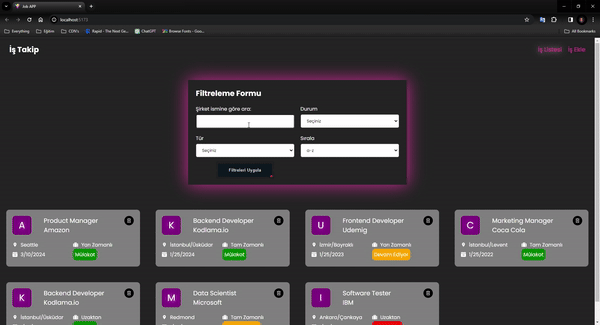

# Job App 
I created a job app with React. I used Redux Toolkit for state management and scss for the design. 

The main purpose is to keep track of the jobs applied for in the application. Place, time and status can be specified separately for each task. 
Filtering can also be done according to these situations.As an extra, I implemented the datalist feature to the application, where previously entered values ​​are shown as examples in the job adding section.

# Libraries

- react-router-dom / axios / sass / react-toastify / json-server / react-redux / @reduxjs/toolkit / uuid / react-icons

